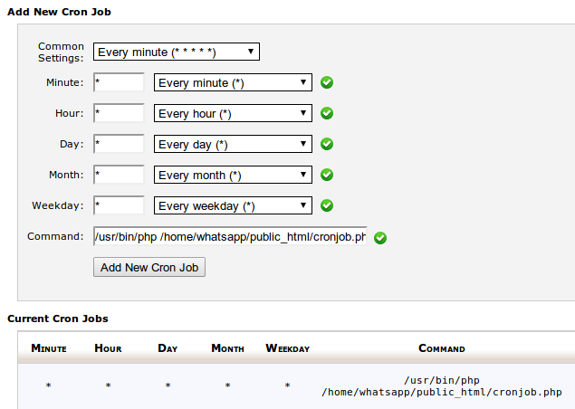

Cron
====================
Messages are sent by script run every minute. Each time script cronjob.php check if there are any messages to send.

* To enable this function log into cpanel and go to Cron Jobs.
* Add new cron job with specific parameters:
    *	*	*	*	*	/usr/bin/php /home/whatsapp/public_html/cronjob.php
    
Asterisk means that command is run every minute, hour, day...

