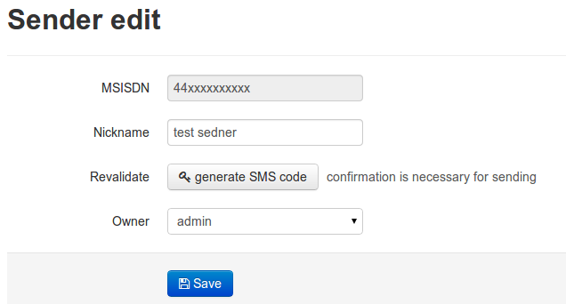
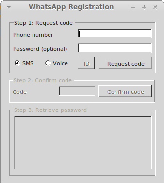

Sender management
====================
Each sender acts as a normal whatsapp user. It has an unique MSISDN/mobile number.

List of sender
---------------------
List of all senders is available in Groups tab (upper page menu).

Creating sender
---------------------
To create a sender click "New sender" in Groups tab.
Provide an MSISDN/mobile number and a human friendly Nickname and click Save.

To be able to send messages each account must be confirmed by SMS code.
It can be generated only for numbers which are not already used with Whatsapp.
To user number already registered with Phone use MissVenom app. The procedure is described at https://github.com/shirioko/MissVenom .

In order to get code code you can click "generate SMS code" button.
The received code put in SMS code box.

Alternatively (if the wasn't sent) you can use [WART](https://github.com/shirioko/WART) program.
Click "generate SMS code" to open SMS code box.
Download WART-1.4.5.0.exe, run it, put phone number and wait for SMS.
The received code put in SMS code box.

