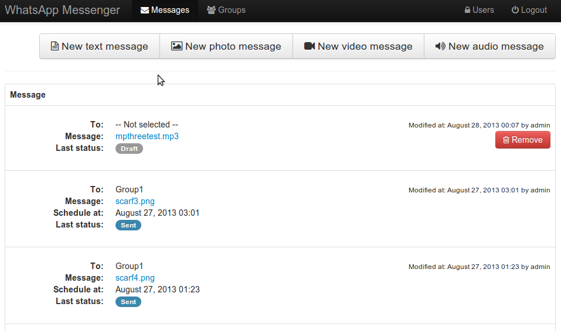
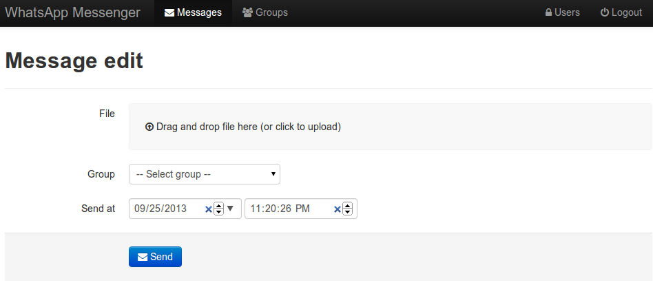
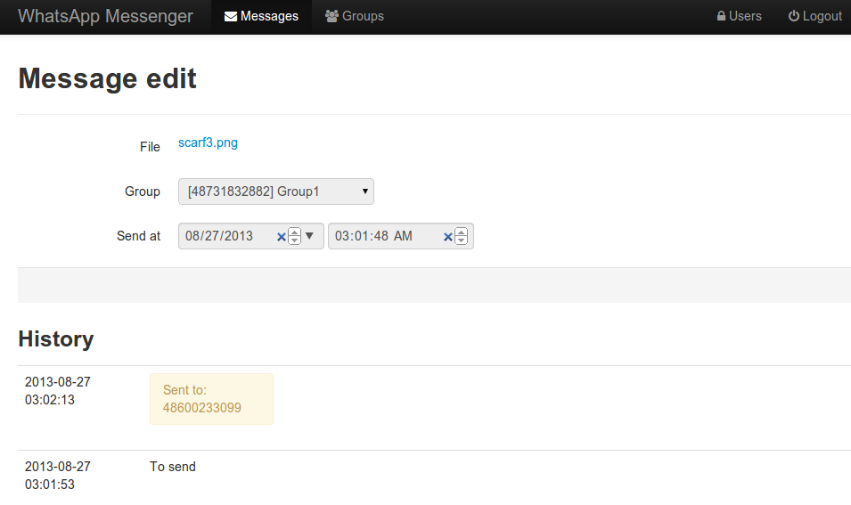

Message sending
====================

List of messages
---------------------
List of all messages is available in Messages tab (upper page menu).

Sending message
---------------------
Select message type with specific button within Messages tab.
Once you click it you're redirected to message edit.
At this point the message status is draft. You can go back to list and delete it with Remove button.

When editing user can enter message or attach file.
User can select sender from a list of senders he registered (or any sender if admin).
User is also supposed to choose group of receivers.

Usually messages are sent immediately but they can also be scheduled with "Send at" field.

Messages are sent every minute. In case of large groups the broadcast can be splited into many separeted tasks and can take few minutes.

### Message statuses

Message has statuses for each operation executed on it. Last status is displayed on messages list.
The detailed list of statuses and its receivers can be viewed within message view.

The first status is Draft. As long as message is not sent it can be edited or removed.

The second status is empty. It means that message cannot be edited and is supposed to be sent immediately or at scheduled time.

Status Sent to server means that message was sent to specific Receiver.

Status Received means that whatsapp server has confired the message. It doesn't mean that message is on the phone and read.

Status Error means error sending to specific receiver.

